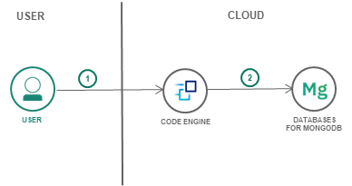

{:step: data-tutorial-type='step'}
{:shortdesc: .shortdesc}
{:new_window: target="_blank"}
{:codeblock: .codeblock}
{:screen: .screen}
{:tip: .tip}
{:pre: .pre}


# Modern web application using MEAN stack
{: #mean-stack}
{: toc-content-type="tutorial"}
{: toc-services="cloud-foundry-public, databases-for-mongodb"}
{: toc-completion-time="1h"}

This tutorial may incur costs. Use the [Cost Estimator](https://{DomainName}/estimator/review) to generate a cost estimate based on your projected usage.
{: tip}


This tutorial walks you through the creation of a web application using the popular MEAN stack. It is composed of a **M**ongo DB, **E**xpress web framework, **A**ngular front end framework and a **N**ode.js runtime. You will learn how to run a MEAN starter locally, create and use a managed database-as-a-service (DBasS), deploy the app to {{site.data.keyword.cloud_notm}} and scale the database resources.
{: shortdesc}

## Objectives
{: #mean-stack-0}

{: #objectives}

- Create and run a starter Node.js app locally.
- Create a managed database-as-a-service (DBasS).
- Deploy the Node.js app to the cloud.
- Scale MongoDB memory and disk resources.

{: #architecture}

{: class="center"}
{: style="text-align: center;"}

1. The user accesses the application using a web browser.
2. The Node.js app accesses the {{site.data.keyword.databases-for-mongodb}} database to fetch data.

## Before you begin
{: #mean-stack-prereqs}

This tutorial requires:
* {{site.data.keyword.cloud_notm}} CLI,
* `git` to clone source code repository.

You will find instructions to download and install these tools for your operating environment in the [Getting started with tutorials](/docs/solution-tutorials?topic=solution-tutorials-tutorials) guide.

In addition, make sure you [install Node.js](https://nodejs.org/).

## Create an instance of MongoDB database in the cloud
{: #mean-stack-2}
{: step}

{: #createdatabase}

In this section, you will create a {{site.data.keyword.databases-for-mongodb}} database in the cloud. {{site.data.keyword.databases-for-mongodb}} is database-as-a-service that usually easier to configure and provides built-in backups and scaling. You can find many different types of databases in the  [IBM cloud catalog](https://{DomainName}/catalog?category=databases#services). To create {{site.data.keyword.databases-for-mongodb}} follow the steps below.

{: shortdesc}

1. Login to your {{site.data.keyword.cloud_notm}} account via the command line and target your {{site.data.keyword.cloud_notm}} account.

   ```sh
   ibmcloud login
   ibmcloud target --cf
   ```
   {: codeblock}

   You can find more CLI commands [here](https://{DomainName}/docs/cli?topic=cli-install-ibmcloud-cli).

2. Create an instance of {{site.data.keyword.databases-for-mongodb}}. This can also be done using the [console UI](https://{DomainName}/catalog/services/databases-for-mongodb). The service name must be named **mean-starter-mongodb** as the application is configured to look for this service by this name.

   ```sh
   ibmcloud cf create-service databases-for-mongodb standard mean-starter-mongodb
   ```
   {: codeblock}

3. Wait for the instance to be ready. You can check the provisioning status with the following command:
   
   ```sh
   ibmcloud cf service mean-starter-mongodb
   ```
   {: codeblock}

4. Create the service key.
  
   ```sh
   ibmcloud cf create-service-key mean-starter-mongodb "Service credentials-1"
   ```
   {: codeblock} 

## Run the MEAN app locally
{: #mean-stack-runapplocally}
{: step}

In this section, you will clone a MEAN sample code and run the application locally to test the connection to the MongoDB database running on {{site.data.keyword.cloud_notm}}.
{: shortdesc}

1. Clone the MEAN starter code.
  
   ```sh
   git clone https://github.com/IBM-Cloud/nodejs-MEAN-stack
   cd nodejs-MEAN-stack
   ```
   {: codeblock}

1. Install the required packages.
  
   ```sh
   npm install
   ```
   {: codeblock}

1. Copy .env.example file to .env.
  
   ```sh
   cp .env.example .env
   ```
   {: codeblock}

1. In the .env file, add your own SESSION_SECRET. For MONGODB_URL and CERTIFICATE_BASE64, run the below command
  
   ```sh
   ibmcloud cf service-key mean-starter-mongodb "Service credentials-1"
   ```
   {: codeblock}

   You can find the URL under mongodb -> composed and certificate_base64 under mongodb -> certificate in the returned JSON output.
1. Run node server.js to start your app
  
   ```sh
   node server.js
   ```
   {: codeblock}

1. Access your application, create a new user and log in

## Deploy app to the cloud
{: #mean-stack-4}
{: step}

{: #deployapp}

In this section, you will deploy the node.js app to the {{site.data.keyword.cloud_notm}} that used the managed MongoDB database. The source code contains a [**manifest.yml**](https://github.com/IBM-Cloud/nodejs-MEAN-stack/blob/master/manifest.yml) file that been configured to use the "mongodb" service created earlier. The application uses VCAP_SERVICES environment variable to access the MongoDB database credentials. This can be viewed in the [server.js file](https://github.com/IBM-Cloud/nodejs-MEAN-stack/blob/master/server.js). To check the VCAP_SERVICES, run `ibmcloud cf env mean-stack`.
{: shortdesc}

1. Push code to the cloud.
   
   ```sh
   ibmcloud cf push
   ```
   {: codeblock}
   
2. Once the code been pushed, you should be able to view the app in your browser. A random host name been generated that can look like: `https://mean-random-name.mybluemix.net`. You can get your application URL from the console dashboard or command line.

## Scaling MongoDB database resources
{: #mean-stack-scaledatabase}
{: step}

If your service needs additional storage, or you want to reduce the amount of storage allocated to your service, you can do this by scaling resources.
{: shortdesc}

1. Using the console **dashboard**, locate the **MongoDB** service instance and click until you are in the **Service Details**.
2. Click on the **Resources** panel.
   
3. Adjust the **slider** to raise or lower the storage allocated to your {{site.data.keyword.databases-for-mongodb}} database service.
4. Click **Scale Deployment** to trigger the rescaling and return to the dashboard overview. It will indicate that the  rescaling is in progress.
5. Alternatively configure autoscaling rules to automatically increase the database resources as its usage is increasing.

## Remove resources
{: #mean-stack-6}
{: removeresources}
{: step}

To remove resource, follow these steps:
1. Visit the [{{site.data.keyword.cloud_notm}} Resource List](https://{DomainName}/resources). Locate your app.
2. Delete the {{site.data.keyword.databases-for-mongodb}} service and its Cloud Foundry alias.
3. Delete the app.

Depending on the resource it might not be deleted immediately, but retained (by default for 7 days). You can reclaim the resource by deleting it permanently or restore it within the retention period. See this document on how to [use resource reclamation](https://{DomainName}/docs/account?topic=account-resource-reclamation).
{: tip}

## Related Content
{: #mean-stack-7}

{: #related}

- Set up source control and [continuous delivery](https://{DomainName}/docs/solution-tutorials?topic=solution-tutorials-multi-region-webapp#multi-region-webapp-devops).
- Secure web application across [multiple locations](https://{DomainName}/docs/solution-tutorials?topic=solution-tutorials-multi-region-webapp).
- Create, secure and manage [REST APIs](https://{DomainName}/docs/solution-tutorials?topic=solution-tutorials-create-manage-secure-apis#create-manage-secure-apis).
